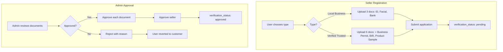
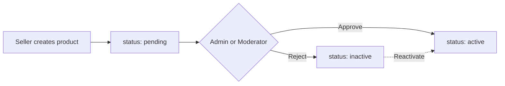
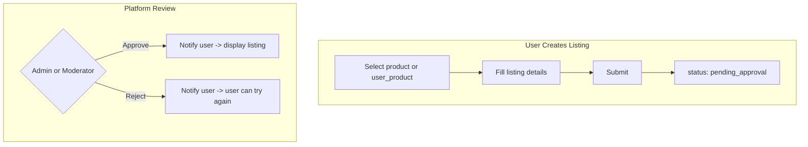
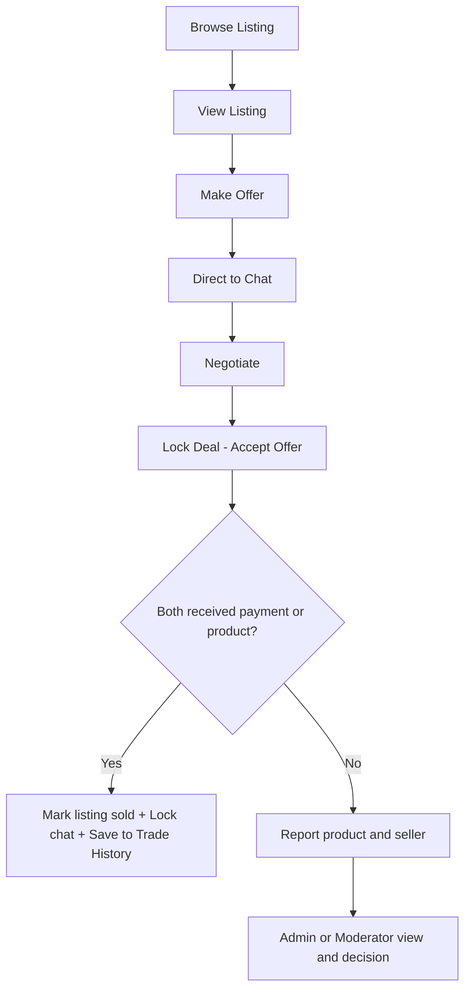
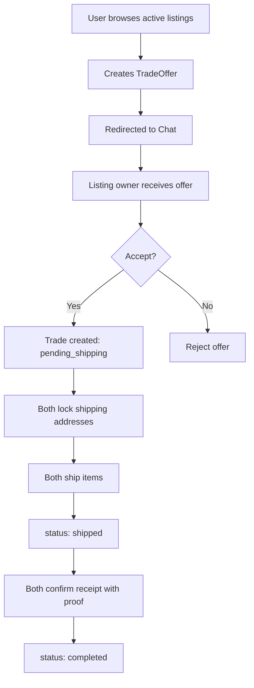
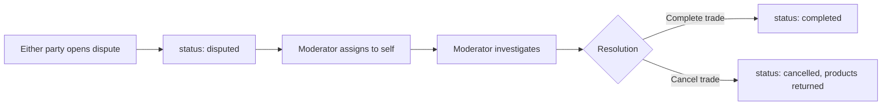
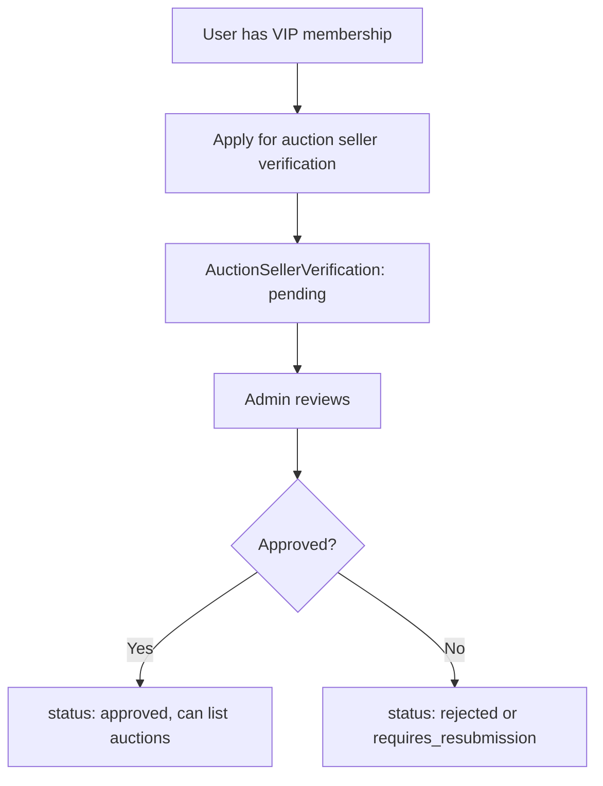
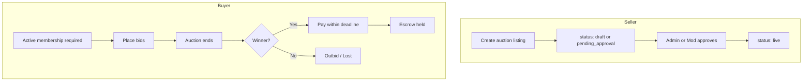
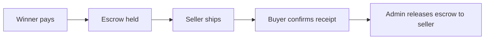

# ToyHaven Platform - Detailed Process Flow Document

This document outlines the process flows for **Toy Shop**, **Trade**, and **Auction** across all roles: **Seller** (and Seller Moderator), **Platform Moderator**, and **Admin**.

---

## Role Hierarchy Overview

| Role                   | Scope          | Notes                                                                                               |
| ---------------------- | -------------- | --------------------------------------------------------------------------------------------------- |
| **Admin**              | Full platform  | Approves sellers/products/auctions, manages moderators, handles escalations, escrow/refunds         |
| **Platform Moderator** | Platform-wide  | Approves products/trade listings/auctions (if permitted), resolves disputes, views/suspends sellers |
| **Seller**             | Own shop       | Business owner; full control over shop, products, orders                                            |
| **Seller Moderator**   | Per-shop staff | Assigned by seller owner; permissions: `products`, `orders`, `business_page`                        |

---

## 1. Toy Shop Process Flow

### 1.1 Seller Registration and Approval

- **Seller**: Registers via [Seller/RegistrationController](app/Http/Controllers/Seller/RegistrationController.php). Two types: Local Business (3 docs) or Verified Trusted (6 docs).
- **Admin**: Reviews documents in [Admin/SellerController](app/Http/Controllers/Admin/SellerController.php). Must approve all required docs before approving seller. Can reject with reason (user reverted to customer).

### 1.2 Product Lifecycle

- **Seller / Seller Moderator (products perm)**: Creates products; new products start as `pending` ([Seller/ProductController](app/Http/Controllers/Seller/ProductController.php)).
- **Admin**: Approves/rejects in [Admin/ProductController](app/Http/Controllers/Admin/ProductController.php) (single or bulk). Can reactivate rejected products.
- **Moderator**: Can approve/reject products via [Moderator/ProductController](app/Http/Controllers/Moderator/ProductController.php).

### 1.3 Order and Delivery Flow

```mermaid
flowchart TB
    subgraph Customer [Customer]
        C1[Add to cart] --> C2[Checkout]
        C2 --> C3[Order placed: pending]
        C3 --> C4[Payment via PayMongo]
        C4 --> C5[payment_status: paid]
    end

    subgraph Seller [Seller / Seller Moderator]
        S1[Process order] --> S2[Packed]
        S2 --> S3[Shipped + tracking]
        S3 --> S4[In Transit / Out for Delivery]
    end

    subgraph PostDelivery [Post-Delivery]
        D1[status: delivered] --> D2[Customer confirms delivery]
        D2 --> D3[Can leave review]
    end
```

- **Order statuses**: `pending` → `processing` → `packed` → `shipped` → `in_transit` → `out_for_delivery` → `delivered` (see [Order model](app/Models/Order.php)).
- **Seller Moderator (orders perm)**: Manages orders for the shop; owner and moderator share dashboard per [SellerModerator](app/Models/SellerModerator.php).

### 1.4 Toy Shop - Role Summary

| Actor                | Key Actions                                                                                                         |
| -------------------- | ------------------------------------------------------------------------------------------------------------------- |
| **Seller**           | Register shop, create products, manage orders, run POS, manage Seller Moderators                                    |
| **Seller Moderator** | Products/Orders/Business page (per permissions); cannot approve seller, add moderators, or change shop verification |
| **Moderator**        | Approve/reject products, view orders, handle order disputes (routes exist), view/suspend sellers                    |
| **Admin**            | Approve/reject sellers and documents, approve/reject products, suspend/activate sellers                             |

---

## 2. Trade Process Flow

### 2.1 Listing structure and request process

- **Create Listing** — User creates a listing; it is submitted as a **pending request** to Admin/Moderator.
- **My Listing** — User sees their listings; from here they can access **Trade History** (completed trades with proof).
- **Listing request outcome**:
  - **If Approved** → User is notified (notification) → listing is displayed in browse.
  - **If Rejected** → User is notified (notification) → user can try again (create a new listing).

### 2.2 Trade Listing Creation and Approval

- **User**: Creates trade listing via [Trading/TradeListingController](app/Http/Controllers/Trading/TradeListingController.php); status is `pending_approval` ([TradeListing model](app/Models/TradeListing.php)).
- **Admin**: Approves/rejects in [Admin/TradeController](app/Http/Controllers/Admin/TradeController.php); approved → [TradeListingApprovedNotification](app/Notifications/TradeListingApprovedNotification.php); rejected → [TradeListingRejectedNotification](app/Notifications/TradeListingRejectedNotification.php).
- **Moderator**: Approves/rejects in [Moderator/TradeListingController](app/Http/Controllers/Moderator/TradeListingController.php) with action logging.

### 2.3 Trade Transaction (execution)

- **Flow**: Browse listing → View listing → Make offer → **Direct to chat** → Negotiate (in chat) → Lock deal (accept offer + lock shipping) → If **both users received** payment/product: mark listing sold, lock history chat, save transaction and listing to **Trade History**. If **both not receive** → user may **report product & seller** → Admin/Moderator view and decision.

- **Make offer → chat**: After submitting an offer, the user is redirected to the conversation (chat) for that listing ([TradeOfferController](app/Http/Controllers/Trading/TradeOfferController.php) redirects to [ConversationController](app/Http/Controllers/Trading/ConversationController.php) show). Negotiation continues in chat; listing owner can accept the offer (lock deal).
- **Trade statuses**: `pending_shipping` → `shipped` → `received` → `completed` ([Trade model](app/Models/Trade.php)). On completion, listing status is set to `completed`, chat is locked (read-only), and the trade appears in **Trade History**.
- **Report trade**: From the trade detail page, either party can submit a **Report** (product/seller not received or other issue). Reports use [Report](app/Models/Report.php) with `reportable_type` = Trade; [Moderator/ReportController](app/Http/Controllers/Moderator/ReportController.php) lists and resolves them.

### 2.4 Trade History (My Listing)

- **Trade History** is available from My Listings ([trading.listings.my](routes/web.php) → link to [trading.trades.history](routes/web.php)).
- **Barter and Barter+Cash**: Each completed trade shows **Trade 1** (listing item) and **Trade 2** (offered item), plus **image product proof received** from both users (initiator and participant).
- **Cash**: Shows the **trade product (listing)** and **image listing proof received** (proof images from both parties where applicable).
- Implemented in [TradeController::history](app/Http/Controllers/Trading/TradeController.php) and [resources/views/trading/trades/history.blade.php](resources/views/trading/trades/history.blade.php).

### 2.5 Trade Execution (detail)

- **TradeService**: Orchestrates creation, offer acceptance, and status updates ([TradeService](app/Services/TradeService.php)).

### 2.6 Trade Disputes

- **Moderator**: Assigns, investigates, resolves in [Moderator/TradeDisputeController](app/Http/Controllers/Moderator/TradeDisputeController.php) (resolution: `completed` or `cancelled`).
- **Admin**: Can resolve disputes and cancel trades in [Admin/TradeController](app/Http/Controllers/Admin/TradeController.php).

### 2.7 Trade - Role Summary

| Actor                   | Key Actions                                                                      |
| ----------------------- | -------------------------------------------------------------------------------- |
| **User (Buyer/Seller)** | Create listings, make offer (then chat), accept/reject offers, lock deal, ship, confirm receipt with proof, complete trade or report product/seller; view Trade History |
| **Moderator**           | Approve/reject trade listings, review trade/listing reports, assign and resolve trade disputes                 |
| **Admin**               | Approve/reject listings, resolve disputes, cancel trades, delete listings        |

---

## 3. Auction Process Flow

Reference: [docs/AUCTION_PROCESS_FLOW.md](docs/AUCTION_PROCESS_FLOW.md)

### 3.1 Auction Seller Verification (Admin Only)

- **Admin only**: Auction seller verification in [Admin/AuctionVerificationController](app/Http/Controllers/Admin/AuctionVerificationController.php). Moderators do not verify auction sellers.

### 3.2 Auction Listing and Bidding

- **Auction statuses**: `draft` → `pending_approval` → `live` → `ended` / `cancelled`.
- **Moderator**: Can approve/reject auctions only if they have `auctions_moderate` permission ([Moderator/AuctionController](app/Http/Controllers/Moderator/AuctionController.php), [User::hasAuctionPermission](app/Models/User.php)).

### 3.3 Post-Sale and Escrow

- **Admin**: Releases escrow, processes refunds, resolves auction disputes ([AuctionPaymentAdminController](app/Http/Controllers/Admin/)).

### 3.4 Auction - Role Summary

| Actor            | Key Actions                                                                                                |
| ---------------- | ---------------------------------------------------------------------------------------------------------- |
| **Buyer**        | Membership, place bids, pay if winner, confirm receipt                                                     |
| **Seller (VIP)** | Auction verification (Admin), create listings, ship after win                                              |
| **Moderator**    | View auctions (if `auctions_view`), approve/reject listings (if `auctions_moderate`), view reports/sellers |
| **Admin**        | Verify auction sellers, approve/reject/cancel auctions, release escrow, refunds                            |

---

## 4. Cross-Cutting Summary

### Admin-Only Actions

- Seller registration approval
- Document approval (seller)
- Auction seller verification
- Escrow release and refunds
- Moderator user/permission management

### Admin and Moderator Shared Actions

- Product approval/rejection
- Trade listing approval/rejection
- Auction listing approval/rejection (Moderator needs `auctions_moderate`)

### Moderator-Only Behaviors

- Trade dispute assignment and resolution
- Order dispute handling (routes defined)
- Seller view/suspend/unsuspend
- Action logging (e.g., ModeratorAction)

### Seller vs Seller Moderator

- **Seller**: Full shop control; only owner can add/remove Seller Moderators and manage shop-level settings.
- **Seller Moderator**: Limited to products, orders, and/or business page per assignment; no seller approval or moderator management.

