# ToyHaven Auction Process Flow

This document describes the professional real-world auction process flow for ToyHaven, covering all roles (Buyer, Seller, Moderator, Admin) and key state transitions.

---

## High-Level Flow Diagram

```mermaid
flowchart TB
    subgraph BuyerFlow [Buyer Flow]
        B1[Browse Auctions] --> B2[Membership Required]
        B2 --> B3[Select Plan]
        B3 --> B4[Accept T&C]
        B4 --> B5[Pay Membership]
        B5 --> B6[Place Bids]
        B6 --> B7{Winner?}
        B7 -->|Yes| B8[Pay Winner Amount]
        B8 --> B9[Confirm Receipt]
        B7 -->|No| B6
    end

    subgraph SellerFlow [Seller Flow]
        S1[Get VIP Membership] --> S2[Seller Verification]
        S2 --> S3[Admin Approval]
        S3 --> S4[Create Auction Listing]
        S4 --> S5[Admin/Mod Approve]
        S5 --> S6[Auction Goes Live]
        S6 --> S7[Escrow on Win]
        S7 --> S8[Ship Item]
        S8 --> S9[Release Escrow]
    end

    subgraph ModFlow [Moderator Flow]
        M1[View Auctions/Bids] --> M2[Flag/Report Review]
        M2 --> M3[Escalate to Admin]
    end

    subgraph AdminFlow [Admin Flow]
        A1[Verify Sellers] --> A2[Approve Auctions]
        A2 --> A3[Manage Mods]
        A3 --> A4[Release Escrow/Refunds]
    end
```

---

## Process Stages by Phase

| Phase | Buyer | Seller | Platform (Admin/Mod) |
|-------|-------|--------|----------------------|
| **Pre-auction** | Join membership, accept T&C, pay plan fee | Complete seller verification, create listing | Admin approves seller verification; Admin or Moderator approves auction listing |
| **Live** | Place bids, receive outbid notifications | Monitor bids, optionally promote auction | Moderator monitors for policy violations; Admin handles escalations |
| **End** | Pay if winner (within deadline), or lose | Await winner payment | Escrow held until seller ships |
| **Post-sale** | Confirm receipt of item | Ship item, provide tracking | Release escrow to seller; handle disputes/refunds per policy |

---

## Role Responsibilities

### Buyer
- Maintain active membership (Basic, Pro, or VIP)
- Place binding bids; pay winner amount + buyer's premium within deadline
- Confirm receipt to release escrow to seller
- Report issues (not as described, damaged) for dispute resolution

### Seller (VIP)
- Complete auction seller verification (ID/business docs)
- Create accurate listings; disclose defects, condition, provenance
- Respond to bids; ship within required timeframe after payment
- Honor reserve price rules; comply with listing limits (e.g. 5 active)

### Moderator
- View auctions and auction reports
- Approve or reject pending auction listings (if permitted)
- Flag auctions for admin review
- View auction sellers (read-only)

### Admin
- Approve/reject seller verifications
- Approve/reject auctions; cancel auctions if needed
- Manage moderator permissions (auction-related)
- Release escrow, process refunds, resolve disputes

---

## State Transitions

### Auction
| Status | Description |
|--------|-------------|
| `draft` | Seller created; not visible publicly |
| `pending_approval` | Awaiting Admin/Moderator approval |
| `live` | Active; accepting bids |
| `ended` | Bidding closed; winner determined |
| `cancelled` | Cancelled by Admin or system |

### AuctionPayment
| payment_status | Description |
|----------------|-------------|
| `pending` | Winner has not yet paid |
| `paid` | Payment received; escrow held |
| `failed` | Payment failed or deadline missed |
| `refunded` | Refund issued (e.g. dispute resolution) |

### AuctionSellerVerification
| status | Description |
|--------|-------------|
| `pending` | Awaiting Admin review |
| `approved` | Can list auctions |
| `rejected` | Verification denied |
| `requires_resubmission` | Admin requested additional docs |

---

## Escrow and Refunds

1. **Escrow**: Winner payment is held in escrow until buyer confirms receipt (or auto-release after timeout).
2. **Release**: Admin releases escrow to seller after buyer confirmation or dispute resolution in seller's favor.
3. **Refund**: Admin can refund for non-delivery, item not as described, or policy violations.
4. **Disputes**: Handled by Admin; may involve partial refunds, full refunds, or escrow release.

---

## References

- Membership plans: `app/Models/Plan.php`, `database/seeders/PlanSeeder.php`
- Auction flow: `app/Http/Controllers/Auction/*`
- Admin auction: `app/Http/Controllers/Admin/AuctionController.php`, `AuctionVerificationController.php`, `AuctionPaymentAdminController.php`
- Moderator auction: `app/Http/Controllers/Moderator/*` (auction routes)
