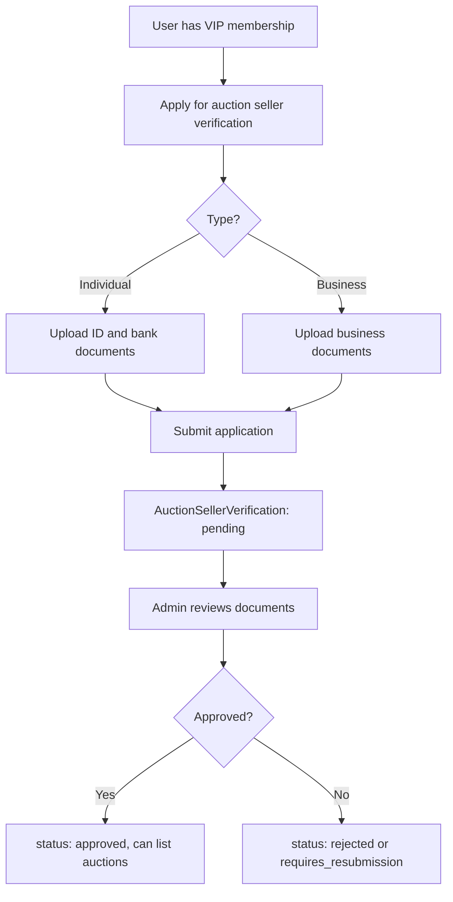
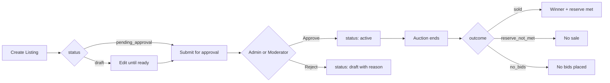
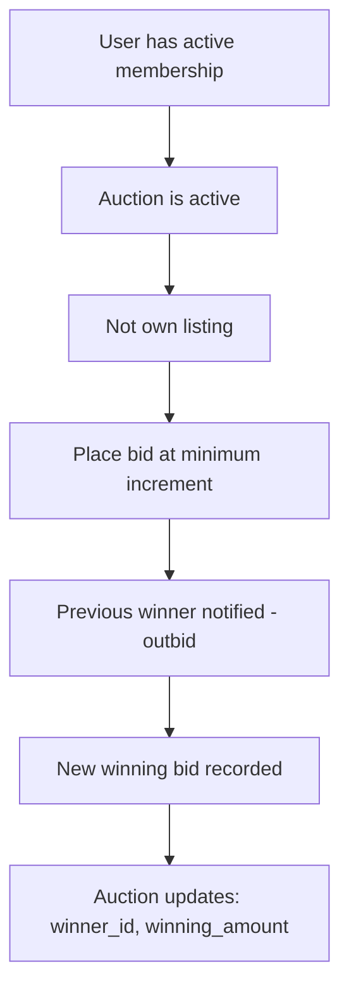
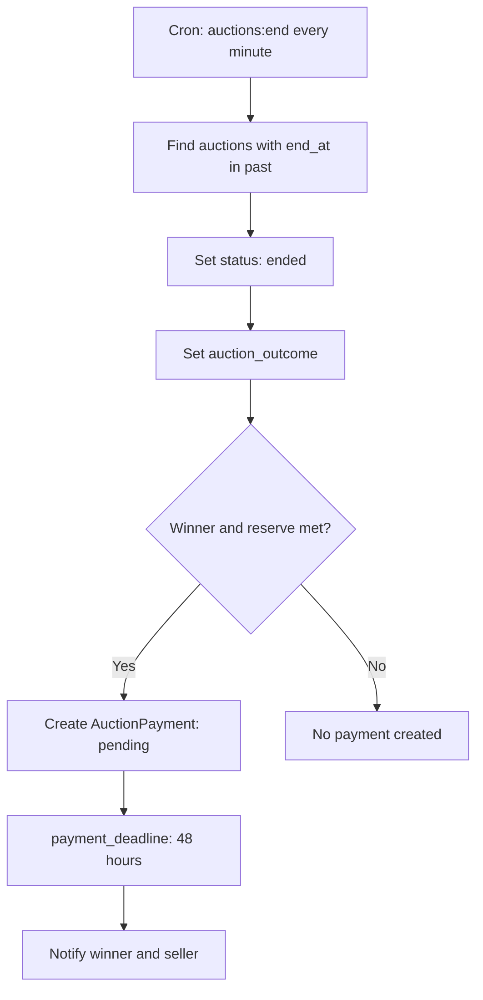
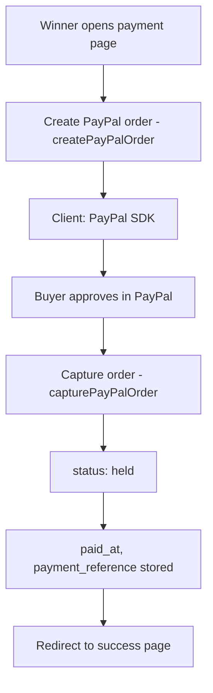
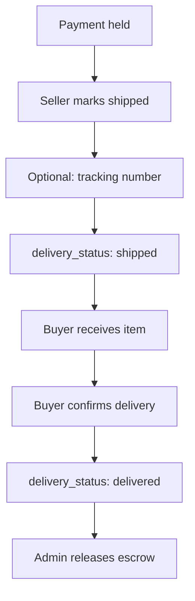
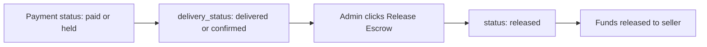
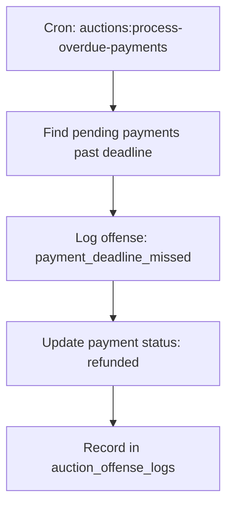

# Auction Process Flow - ToyHaven Platform

This document describes the complete end-to-end auction process flow, including seller verification, listing lifecycle, bidding, payment, delivery, escrow, and post-sale review.

---

## 1. High-Level Process Flow

```mermaid
flowchart TB
    subgraph SellerFlow [Seller Flow]
        S1[VIP Membership] --> S2[Auction Seller Verification]
        S2 --> S3[Admin Approves]
        S3 --> S4[Create Listing]
        S4 --> S5[draft or pending_approval]
        S5 --> S6[Admin or Moderator Approves]
        S6 --> S7[status: active]
        S7 --> S8[Auction Ends]
        S8 --> S9[Winner Pays via PayPal]
        S9 --> S10[Escrow Held]
        S10 --> S11[Seller Ships]
        S11 --> S12[Buyer Confirms Delivery]
        S12 --> S13[Admin Releases Escrow]
    end

    subgraph BuyerFlow [Buyer Flow]
        B1[Active Membership] --> B2[Place Bids]
        B2 --> B3[Win Auction]
        B3 --> B4[Pay within 48h]
        B4 --> B5[Await Shipment]
        B5 --> B6[Confirm Receipt]
        B6 --> B7[Leave Review]
    end
```

---

## 2. Seller Verification (Admin Only)

- **Requirement**: VIP membership is required to register as an auction seller.
- **Types**: Individual or Business seller. Each requires different documents.
- **Controller**: `App\Http\Controllers\Admin\AuctionSellerVerificationController`
- **Moderators**: Do not verify auction sellers; Admin only.

---

## 3. Listing Lifecycle

| Status | Description |
|--------|-------------|
| `draft` | Listing created, not yet submitted |
| `pending_approval` | Submitted, awaiting Admin or Moderator review |
| `active` | Live auction; bids accepted |
| `ended` | Auction finished; outcome set |

| Auction Outcome | Condition |
|-----------------|-----------|
| `sold` | Winner exists and reserve price met |
| `reserve_not_met` | Winner exists but winning amount below reserve |
| `no_bids` | No bids placed |

---

## 4. Bidding Flow

### Bidding Rules

- **Membership**: Active membership required.
- **Amount**: Minimum increment only: `next_min_bid = current_bid + bid_increment`. Custom amounts above minimum are not accepted.
- **Restrictions**: Cannot bid on own listing; user must not be suspended or banned.
- **Controller**: `App\Http\Controllers\Auction\AuctionBidController`
- **Notifications**: Previous winning bidder receives `AuctionOutbidNotification`.

---

## 5. Auction End and Payment Creation

- **Command**: `php artisan auctions:end`
- **Schedule**: Run every minute via Laravel scheduler.
- **Payment creation**: Only when `winner_id` exists and `meetsReserve()` is true.
- **Deadline**: 48 hours to pay.
- **Notifications**: `AuctionWonNotification` (winner), `AuctionWonSellerNotification` (seller).

---

## 6. Payment Flow (PayPal)

| Payment Status | Meaning |
|----------------|---------|
| `pending` | Awaiting payment within deadline |
| `paid` / `held` | PayPal payment captured; funds held in escrow |
| `released` | Admin released to seller after delivery confirmed |
| `refunded` | Winner did not pay; or refund issued |

- **Controller**: `App\Http\Controllers\Auction\AuctionPaymentController`
- **Method**: PayPal only (srmklive/paypal). PayMongo/QRPH not used for auctions.
- **Escrow**: Funds held until Admin releases after buyer confirms delivery.

---

## 7. Delivery Flow

- **Seller**: Marks shipped from Seller Dashboard (`auction/seller/dashboard`). Modal to add optional tracking number.
- **Buyer**: Confirms delivery on Payment Success page (`auction/payment/{id}/success`).
- **Routes**: `POST auction/payment/{payment}/shipped`, `POST auction/payment/{payment}/confirm-delivery`.
- **Controller**: `AuctionPaymentController::markShipped`, `AuctionPaymentController::confirmDelivery`.

---

## 8. Escrow Release (Admin)

- **Controller**: `App\Http\Controllers\Admin\AuctionPaymentController::release`
- **Prerequisites**: `status` in `['paid', 'held']` and `delivery_status` in `['delivered', 'confirmed']`.
- **Route**: `POST admin/auction-payments/{payment}/release`.

---

## 9. Overdue Payment Handling

- **Command**: `php artisan auctions:process-overdue-payments`
- **Action**: Marks overdue payment as `refunded`, logs offense for the winner. No second-chance flow (table dropped).
- **Table**: `auction_offense_logs` stores `payment_deadline_missed` with `action_taken: refunded_no_second_chance`.

---

## 10. Review Flow

- **When**: After buyer confirms delivery (`delivery_status` is `delivered` or `confirmed`).
- **Where**: Payment Success page shows review form.
- **Controller**: `App\Http\Controllers\Auction\AuctionReviewController::store`
- **Model**: `AuctionReview` linked to `auction_payment_id`.

---

## 11. Role Summary

| Actor | Key Actions |
|-------|-------------|
| **Buyer** | Membership, place bids, pay if winner (48h), confirm receipt, leave review |
| **Seller (VIP)** | Auction verification (Admin), create listings, ship after win |
| **Moderator** | Approve/reject listings (if `auctions_moderate` permission) |
| **Admin** | Verify auction sellers, approve/reject auctions, release escrow, handle refunds |

---

## 12. Key Files Reference

| Component | Path |
|-----------|------|
| Auction model | `app/Models/Auction.php` |
| AuctionPayment model | `app/Models/AuctionPayment.php` |
| AuctionBidController | `app/Http/Controllers/Auction/AuctionBidController.php` |
| AuctionPaymentController | `app/Http/Controllers/Auction/AuctionPaymentController.php` |
| Admin AuctionPaymentController | `app/Http/Controllers/Admin/AuctionPaymentController.php` |
| EndAuctionsCommand | `app/Console/Commands/EndAuctionsCommand.php` |
| ProcessOverdueAuctionPaymentsCommand | `app/Console/Commands/ProcessOverdueAuctionPaymentsCommand.php` |
| Payment page | `resources/views/auction/payment/show.blade.php` |
| Payment success | `resources/views/auction/payment/success.blade.php` |
| Seller dashboard | `resources/views/auction/seller/dashboard.blade.php` |
| Admin payments | `resources/views/admin/auction-payments/index.blade.php` |
